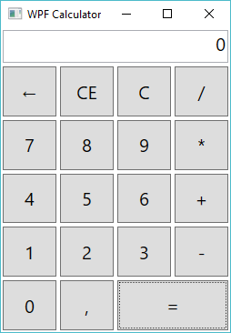

# WPFCalc
[](https://dev.azure.com/igorocampos/PersonalProjects/_build?definitionId=3)
[](https://app.fossa.io/projects/git%2Bgithub.com%2Figorocampos%2FWPFCalc?ref=badge_shield)

This is a simple calculator WPF project that used Class Interface on the operations. It is more of a tutorial for those starting with WPF, especially those who are migrating from WinForms.  



# What will you need
This project was initially made using
- Visual Studio 2015
- .NET Framework 4.5.2

But it was updated to 
- Visual Studio 2022
- .NET 6.0

Basically only the target framework was updated, so if you really need, you can downgrade it back to your version instead of using the latest. If you wish to downgrade it back to .NET Framework, be sure to see [this commit](https://github.com/igorocampos/WPFCalc/commit/5b3c95390b9a22fadd1df1f0afa36e367011118e)

# Getting started
First of all open Visual Studio and Create a new project and select New WPF Application.
There should be now inside your project a file named `MainWindow.xaml`. This file is the WPF version of WinForms `designer` file. It is a markup file, where we can change some attributes in order to set the design of the ~~form~~ window and its components as we want.

For example in the opening tag of `Window`, we could change the attribute `Title` to `WPF Calculator`, set the `Width` and `Height` and even set the Window startup location.

```xaml
Title="WPF Calculator" 
Height="400" 
Width="280" 
WindowStartupLocation="CenterScreen"
```

Alternatively, you can use Visual Studio to change the `XAML` file for you, just select the `Window` tag and press `F4`, or your personal shortcut, to open `Properties window`. There you will have all the properties of the `Window`.

These properties can also be changed by code after the `InitializeComponent` method call. This part of the code will be in the constructor of `MainWindow` class, you can reach it opening the file named `MainWindow.xaml.cs`, or usually just pressing the shortcut `F7` while having`MainWindow.xaml` opened on the screen.

# Let's get to it
If you come from `WinForms` type of design you would rather insert a bunch of buttons inside this `Window` thing, setting their position and size. However WPF would accept it, Here we will use more of a responsive way, in other words, when our calculator window gets stretched we want all buttons to follow it. This is a little bit different than `Anchoring` in `WinForms` since we want all buttons to stretch equally and without overlaying each other.

## Grid
The component that we need to get it done is called `Grid` and we can insert it as easy as typing `<Grid></Grid>` inside the `Window` tag.

After that, we want to set the Rows and Columns definitions, as below:
```xaml
<Grid>
    <Grid.RowDefinitions>
        <RowDefinition Height="40"/>
        <RowDefinition Height="*"/>
        <RowDefinition Height="*"/>
        <RowDefinition Height="*"/>
        <RowDefinition Height="*"/>
        <RowDefinition Height="*"/>
    </Grid.RowDefinitions>
    <Grid.ColumnDefinitions>
        <ColumnDefinition Width="*"/>
        <ColumnDefinition Width="*"/>
        <ColumnDefinition Width="*"/>
        <ColumnDefinition Width="*"/>
    </Grid.ColumnDefinitions>
</Grid>
```
Here we said that we want 6 rows and 4 columns in our grid, and all columns should have the same width dividing the total width of the Grid equally. Same for the rows height, except the first one, which will have a fixed height of `40`. We will use this row for our Textbox.

Just like the `Window`, this `Grid` component properties can be changed by Visual Studio in the Properties window.

## Textbox
Ok, now we can insert all our visual components inside this grid. First, let's add a `Textbox` that will work as our calculator's display.

```xaml
<TextBox x:Name="txtInput" Grid.Row="0" Grid.ColumnSpan="4" Margin="2" TextAlignment="Right" Text="0" FontSize="20" IsReadOnly="True"/>
```
 In this we are saying that:
- Our `TextBox` should be named `txtInput`
- Its row position should be the first one (position `0`)
- It should Span for 4 columns
- It should have a margin of `2` in every direction
- Its text aligment should be to the right
- Its default text should be `"0"`
- The text font size should be `20`
- Finally it should be a read-only Textbox.

Again all this could also be set in the Properties window, but for me editing directly the XAML is so much easier!

## Number buttons
Now, pretty much the same for the number buttons:
```xaml
<Button x:Name="btn7" Content="7" Grid.Row="2" Grid.Column="0" FontSize="20" Margin="2" />
<Button x:Name="btn8" Content="8" Grid.Row="2" Grid.Column="1" FontSize="20" Margin="2" />
<Button x:Name="btn9" Content="9" Grid.Row="2" Grid.Column="2" FontSize="20" Margin="2" />
<Button x:Name="btn4" Content="4" Grid.Row="3" Grid.Column="0" FontSize="20" Margin="2" />
<Button x:Name="btn5" Content="5" Grid.Row="3" Grid.Column="1" FontSize="20" Margin="2" />
<Button x:Name="btn6" Content="6" Grid.Row="3" Grid.Column="2" FontSize="20" Margin="2" />
<Button x:Name="btn1" Content="1" Grid.Row="4" Grid.Column="0" FontSize="20" Margin="2" />
<Button x:Name="btn2" Content="2" Grid.Row="4" Grid.Column="1" FontSize="20" Margin="2" />
<Button x:Name="btn3" Content="3" Grid.Row="4" Grid.Column="2" FontSize="20" Margin="2" />
<Button x:Name="btn0" Content="0" Grid.Row="5" Grid.Column="0" FontSize="20" Margin="2" />
```
There is no `Text` property in a WPF Button, instead we use its `Content` property.

## Other buttons
We will finish our design by adding the remaining buttons:
```xaml
<Button x:Name="btnPoint" Content="." Grid.Row="5" Grid.Column="1" FontSize="20" Margin="2" />
<Button x:Name="btnDivision" Content="/" Grid.Row="1" Grid.Column="3" FontSize="20" Margin="2" />
<Button x:Name="btnMultiplication" Content="*" Grid.Row="2" Grid.Column="3" FontSize="20" Margin="2" />
<Button x:Name="btnSum" Content="+" Grid.Row="3" Grid.Column="4" FontSize="20" Margin="2" />
<Button x:Name="btnSubtraction" Content="-" Grid.Row="4" Grid.Column="3" FontSize="20" Margin="2" />
<Button x:Name="btnEquals" Content="=" Grid.Row="5" Grid.Column="2" FontSize="20" Margin="2" Grid.ColumnSpan="2" />
<Button x:Name="btnBack" Content="←" Grid.Row="1" Grid.Column="0" FontSize="20" Margin="2" />
<Button x:Name="btnClearEntry" Content="CE" Grid.Row="1" Grid.Column="1" FontSize="20" Margin="2" />
<Button x:Name="btnClearAll" Content="C" Grid.Row="1" Grid.Column="2" FontSize="20" Margin="2" />
```
- `C` will be the Clear All button
- `CE` will be Clear Entry, wich only clears what you are currently typing
- `←` will be the Backspace button that erases the last typed digit
- `.` will be the Decimal Separator, however we shall talk about this later

## Events
All set with the design, we need to set some click events for the buttons.
This is very simple, just add the `Click` attribute in the Button tag like this:
```xaml
<Button x:Name="btn7" Content="7" Grid.Row="2" Grid.Column="0" FontSize="20" Margin="2" Click=""/>
```
Visual Studio will open a suggestion window where the first option is `<New Event Handler>` if you select it, it will automatically create a method for this event in the `MainWindow.xaml.cs` file, like this:
```cs
private void btnPoint_Click(object sender, RoutedEventArgs e)
{

}
```

But we don't need an event handler for every button. Some behaviors are pretty much the same.  Let's create the `regularButtonClick` method and link it with all number buttons:

```cs
private void regularButtonClick(object sender, RoutedEventArgs e)
{
    //Prevent 0 from appearing on the left of new numbers
    if (txtInput.Text == "0")
        txtInput.Text = "";

    txtInput.Text = $"{txtInput.Text}{((Button)sender).Content}";
}
```
```xaml
<Button x:Name="btn7" Content="7" Grid.Row="2" Grid.Column="0" FontSize="20" Margin="2" Click="regularButtonClick"/>
<Button x:Name="btn8" Content="8" Grid.Row="2" Grid.Column="1" FontSize="20" Margin="2" Click="regularButtonClick"/>
<Button x:Name="btn9" Content="9" Grid.Row="2" Grid.Column="2" FontSize="20" Margin="2" Click="regularButtonClick"/>
<Button x:Name="btn4" Content="4" Grid.Row="3" Grid.Column="0" FontSize="20" Margin="2" Click="regularButtonClick"/>
<Button x:Name="btn5" Content="5" Grid.Row="3" Grid.Column="1" FontSize="20" Margin="2" Click="regularButtonClick"/>
<Button x:Name="btn6" Content="6" Grid.Row="3" Grid.Column="2" FontSize="20" Margin="2" Click="regularButtonClick"/>
<Button x:Name="btn1" Content="1" Grid.Row="4" Grid.Column="0" FontSize="20" Margin="2" Click="regularButtonClick"/>
<Button x:Name="btn2" Content="2" Grid.Row="4" Grid.Column="1" FontSize="20" Margin="2" Click="regularButtonClick"/>
<Button x:Name="btn3" Content="3" Grid.Row="4" Grid.Column="2" FontSize="20" Margin="2" Click="regularButtonClick"/>
<Button x:Name="btn0" Content="0" Grid.Row="5" Grid.Column="0" FontSize="20" Margin="2" Click="regularButtonClick"/>
```
This will pretty much, add the clicked digit to the ending of the display, except when the display has a single `0`.

The decimal separator has a little bit different behavior: 
- Only one decimal separator is allowed in numbers

Also, your decimal separator symbol can be different from mine! We should get wich symbol to use from the OS. Here is how we can do it:
- Create a get only `string` property called `DecimalSeparator`
- In the class constructor let's change the Button content to display the correct symbol

```cs
string DecimalSeparator => CultureInfo.CurrentUICulture.NumberFormat.NumberDecimalSeparator;

public MainWindow()
{
    InitializeComponent();
    btnPoint.Content = DecimalSeparator;
}
```

Now we can just create an Event Handler for our decimal separator button

```cs
private void btnPoint_Click(object sender, RoutedEventArgs e)
{
    if (txtInput.Text.Contains(this.DecimalSeparator))
        return;

    regularButtonClick(sender, e);
}
```

Now a handler for `Backspace`, `Clear Entry` and `Clear All` buttons
```cs
private void btnBack_Click(object sender, RoutedEventArgs e)
{
    //Prevent from clearing zero
    if (txtInput.Text == "0")
        return;

    txtInput.Text = txtInput.Text.Substring(0, txtInput.Text.Length - 1);
    if (txtInput.Text == "")
        txtInput.Text = "0";
}
private void btnClearEntry_Click(object sender, RoutedEventArgs e)
   => txtInput.Text = "0";

private void btnClearAll_Click(object sender, RoutedEventArgs e)
{
    //ToDo: This should also clear the current operation and saved first value
    txtInput.Text = "0";
}
```
```xaml
<Button x:Name="btnBack" Content="←" Grid.Row="1" Grid.Column="0" FontSize="20" Margin="2" Click="btnBack_Click"/>
<Button x:Name="btnClearEntry" Content="CE" Grid.Row="1" Grid.Column="1" FontSize="20" Margin="2" Click="btnClearEntry_Click"/>
<Button x:Name="btnClearAll" Content="C" Grid.Row="1" Grid.Column="2" FontSize="20" Margin="2" Click="btnClearAll_Click"/>
```

The remaining buttons will get their events later on. First, we need to talk about the operations.

## Operations
Basically, all 4 operations will need 2 numbers and will return a decimal result.
In order to save some code lines and getting things more maintainable, we will use here a Class Interface. A very simple one indeed:

```cs
public interface IOperation
{
    decimal DoOperation(decimal val1, decimal val2);
}
```

And now we will have 4 classes that implement this interface

```cs
public class Sum : IOperation
{
    public decimal DoOperation(decimal val1, decimal val2) => val1 + val2;
}

public class Subtraction : IOperation
{
    public decimal DoOperation(decimal val1, decimal val2) => val1 - val2;
}

public class Division : IOperation
{
    public decimal DoOperation(decimal val1, decimal val2) => val1 / val2;
}
public class Multiplication : IOperation
{
    public decimal DoOperation(decimal val1, decimal val2) => val1 * val2;
}
```

I just coded all this in the same `Operations.cs` file, but if you prefer, you can get a different file for every class and another one for the interface.

Now we can have some polymorphism with the operation buttons.

### Current Operation
In order to know which Operation to do, we will need an `IOperation` variable, which we will call `CurrentOperation`.
```cs
IOperation CurrentOperation;
```

### First Value
We will also need to save somewhere the first value typed right before the Operation Button Click. 
For this, let's create a property called `FirstValue`.
```cs
decimal FirstValue { get; set; }
```

### Linking the Operations to their class
Now we need to link all 4 operation buttons to its related class. We can do this using the `Tag` property of the buttons. This property has the `object` type, which can very well be our implementation of `IOperation`.

```cs
public MainWindow()
{
    InitializeComponent();
    btnPoint.Content = DecimalSeparator;
    btnSum.Tag = new Sum();
    btnSubtraction.Tag = new Subtraction();
    btnDivision.Tag = new Division();
    btnMultiplication.Tag = new Multiplication();
}
```

### Event Handler
And finally using all this together we will have something like this:
```cs
private void operationButton_Click(object sender, RoutedEventArgs e)
{
    //if current operation is not null then we already have the FirstValue
    if (CurrentOperation == null)
        FirstValue = Convert.ToDecimal(txtInput.Text);

    CurrentOperation = (IOperation)((Button)sender).Tag;
    txtInput.Text = "";
}
```
```xaml
<Button x:Name="btnDivision" Content="/" Grid.Row="1" Grid.Column="3" FontSize="20" Margin="2" Click="operationButton_Click"/>
<Button x:Name="btnMultiplication" Content="*" Grid.Row="2" Grid.Column="3" FontSize="20" Margin="2" Click="operationButton_Click"/>
<Button x:Name="btnSum" Content="+" Grid.Row="3" Grid.Column="4" FontSize="20" Margin="2" Click="operationButton_Click"/>
<Button x:Name="btnSubtraction" Content="-" Grid.Row="4" Grid.Column="3" FontSize="20" Margin="2" Click="operationButton_Click"/>
```

### Clear All
Now we can change the Clear All button click to 
```cs
private void btnClearAll_Click(object sender, RoutedEventArgs e)
{
    FirstValue = 0;
    CurrentOperation = null;
    txtInput.Text = "0";
}
```

### Equals Button
For last we can code our Equals button click
```cs
private void btnEquals_Click(object sender, RoutedEventArgs e)
{
    if (CurrentOperation == null)
        return;

    if (txtInput.Text == "")
        return;

    decimal val2 = Convert.ToDecimal(txtInput.Text);
    txtInput.Text = CurrentOperation.DoOperation(FirstValue, val2).ToString();
}
```
```xaml
<Button x:Name="btnEquals" Content="=" Grid.Row="5" Grid.Column="2" FontSize="20" Margin="2" Grid.ColumnSpan="2" Click="btnEquals_Click"/>
```

#### Multiple Equals button click
Perhaps you are familiar with the behavior of pressing multiple times the button equals in the calculator. The result is the last operation repeated again and again.
In order to get this, we will also need to save somehow the last typed value instead of using what appears in the display.
Let's create a nullable decimal property for this.
```cs
decimal? SecondValue { get; set; }
```

When SecondValue is null then button equals was not pressed yet.
Thus, we can reset it on the operation buttons click event
```cs
private void operationButton_Click(object sender, RoutedEventArgs e)
{
    //if current operation is not null then we already have the FirstValue
    if (CurrentOperation == null)
        FirstValue = Convert.ToDecimal(txtInput.Text);

    CurrentOperation = (IOperation)((Button)sender).Tag;
    SecondValue = null;
    txtInput.Text = "";
}
```
Our event handler will now look like this:
```cs
private void btnEquals_Click(object sender, RoutedEventArgs e)
{
    if (CurrentOperation == null)
        return;

    if (txtInput.Text == "")
        return;

    //SecondValue is used for multiple clicks on Equals bringing the newest result of last operation
    decimal val2 = SecondValue ?? Convert.ToDecimal(txtInput.Text);
    txtInput.Text = (FirstValue = CurrentOperation.DoOperation(FirstValue, (decimal)(SecondValue = val2))).ToString();
}
```
This last line is a little bit tricky. It is actually the simplification of 
```cs
var result = CurrentOperation.DoOperation(FirstValue, val2);
txtInput.Text = result.ToString();
FirstValue = result;
SecondValue = val2;
```
# Improving UX
We can do better allowing not only clicks on the buttons but also keyboard typing.
Here we will have one more difference from `WinForms`. There is no `KeyPress` event that gives the pressed `KeyChar`.

You could try and use the `KeyDown` event, along with the `e.Key` in a switch, but it gets tricky with the `*` and `/` because they are different in some keyboards...

So instead we should use the `PreviewTextInput` event. Our xaml will be changed to:
```xaml
<Window x:Class="WPFCalc.MainWindow"
        xmlns="http://schemas.microsoft.com/winfx/2006/xaml/presentation"
        xmlns:x="http://schemas.microsoft.com/winfx/2006/xaml"
        xmlns:d="http://schemas.microsoft.com/expression/blend/2008"
        xmlns:mc="http://schemas.openxmlformats.org/markup-compatibility/2006"
        xmlns:local="clr-namespace:WPFCalc"
        mc:Ignorable="d"
        Title="WPF Calculator" 
        Height="400" 
        Width="280" 
        PreviewTextInput="Window_PreviewTextInput" 
        WindowStartupLocation="CenterScreen">
```
And we will have this method on `MainWindow.xaml.cs`
```cs
private void Window_PreviewTextInput(object sender, TextCompositionEventArgs e)
{
   
}
```

## SendToInput()
Instead of firing `regularButtonClick` we can create a method called `SendToInput` since we will already know which string to send, and will not need to check the button's `Content` for this.

```cs
private void regularButtonClick(object sender, RoutedEventArgs e)
    => SendToInput(((Button)sender).Content.ToString());

private void SendToInput(string content)
{
    //Prevent 0 from appearing on the left of new numbers
    if (txtInput.Text == "0")
        txtInput.Text = "";

    txtInput.Text = $"{txtInput.Text}{content}";
}
```
## PerformClick()
There is no `PerformClick` method in `WPF`...
However, we can work around this creating our own Extension Method:
```cs
public static void PerformClick(this Button btn)
    => btn.RaiseEvent(new RoutedEventArgs(Button.ClickEvent));
```
You can put this in any public static class. I chose to create a file called `ExtMethods.cs` and create a public static class with the same name for it.

## PreviewTextInput
Finally our PreviewTextInput method will look like this:
```cs
private void Window_PreviewTextInput(object sender, TextCompositionEventArgs e)
{
    switch (e.Text)
    {
        case "0":
        case "1":
        case "2":
        case "3":
        case "4":
        case "5":
        case "6":
        case "7":
        case "8":
        case "9":
            SendToInput(e.Text);
            break;

        case "*":
            btnMultiplication.PerformClick();
            break;

        case "-":
            btnSubtraction.PerformClick();
            break;

        case "+":
            btnSum.PerformClick();
            break;

        case "/":
            btnDivision.PerformClick();
            break;

        case "=":
            btnEquals.PerformClick();
            break;

        default:
            //Can't use directly from switch because it is not a constant
            if (e.Text == DecimalSeparator)
                btnPoint.PerformClick();
            else if (e.Text[0] == (char)8)
                btnBack.PerformClick();
            else if (e.Text[0] == (char)13)
                btnEquals.PerformClick();

            break;
    }

    //This will prevent other buttons focus firing its click event on <ENTER> while typing
    btnEquals.Focus();
}
```

# Unit Tests
This might be silly, but the most important here is the principle of Unit Testing. Here, our main goal is:
- If anyone in the future changes the Operations' classes and interface, we guarantee that it did not break our calculator, in other words, our calculator will still do successfully all 4 operations.

## Adding a Test Project
This is pretty straight forward, you just add a new `Test Project` in your solution, I even chose a .NET Core 2.2 Test Project since we won't be needing any WFP components for this tests.

After that, you'll need to add the Calculator's project as a dependency to the Test project (Right-click in Dependencies>Add Reference...)

## Testing the polymorphism 
We want to be sure that every operation class is an implementation of `IOperation`. We can do that simple as below:
```cs
[TestMethod]
public void Sum_IsIOperation()
{
    var sum = new Sum();
    Assert.IsTrue(sum is IOperation);
}

[TestMethod]
public void Subtraction_IsIOperation()
{
    var subtraction = new Subtraction();
    Assert.IsTrue(subtraction is IOperation);
}

[TestMethod]
public void Division_IsIOperation()
{
    var division = new Division();
    Assert.IsTrue(division is IOperation);
}

[TestMethod]
public void Multiplication_IsIOperation()
{
    var multiplication = new Multiplication();
    Assert.IsTrue(multiplication is IOperation);
}
```

The test will fail where the operation class is not an implementation of `IOperation`.


## Testing the operations
Basically, we guarantee in these tests that 2 random decimal numbers will result in the desired operation when method `DoOperation` is called.

```cs
[TestMethod]
public void Sum_IsSuming()
{
    var sum = new Sum();
    var rnd = new Random();
    var a = (Decimal)rnd.NextDouble();
    var b = (Decimal)rnd.NextDouble();
    var result = sum.DoOperation(a, b);
    Assert.AreEqual(a + b, result);
}

[TestMethod]
public void Subtraction_IsSubtracting()
{
    var subtraction = new Subtraction();
    var rnd = new Random();
    var a = (Decimal)rnd.NextDouble();
    var b = (Decimal)rnd.NextDouble();
    var result = subtraction.DoOperation(a, b);
    Assert.AreEqual(a - b, result);
}

[TestMethod]
public void Multiplication_IsMultiplying()
{
    var multiplication = new Multiplication();
    var rnd = new Random();
    var a = (Decimal)rnd.NextDouble();
    var b = (Decimal)rnd.NextDouble();
    var result = multiplication.DoOperation(a, b);
    Assert.AreEqual(a * b, result);
}

[TestMethod]
public void Division_IsDividing()
{
    var division = new Division();
    var rnd = new Random();
    var a = (Decimal)rnd.NextDouble();
    var b = (Decimal)rnd.NextDouble();

    //Can't divide by 0
    while (b == 0)
        b = (Decimal)rnd.NextDouble();

    var result = division.DoOperation(a, b);
    Assert.AreEqual(a / b, result);
}
```

This is not a 100% guarantee because 2 random numbers can make a successfully operation by using `DoOperation`, while other 2 would not.
However, these unit tests will at least warn us when any 2 random numbers do not match with the operation's result.

### Division by Zero
If by any chance our division test gets `0` as the second random number, we should generate a new one. And actually, we should do so until the generated number is different from zero!

## Testing Division by Zero
For last, we can make a unit test to make sure when using `DoOperation` of `Division` class with a `0` in the second parameter will result in a `DivideByZeroException`.

```cs
[TestMethod]
public void DivisionByZero_IsGivingException()
{
    var division = new Division();
    var rnd = new Random();
    var a = (Decimal)rnd.NextDouble();
    Assert.ThrowsException<DivideByZeroException>(() => division.DoOperation(a, 0));
}
```

## Porting to .NET 6.0
As of 2022-10-07 this project has been updated to the latest LTS version of .NET, compiled and tested using Visual Studio 2022.

## Porting to .NET Core 3.0
~~For now, Visual Studio 2019 only supports the WPF Designer in .NET Framework projects. I have the intention to port this project as soon as Visual Studio starts to support WPF Designer in .NET Core. However, if you wish to do it sooner, there is a workaround explained [here](https://docs.microsoft.com/en-us/dotnet/core/porting/wpf#wpf-designer).~~

### Update 2019-09-25
From this week's release of VS2019 16.3.0, VS will render WPF design, so as promissed, I ported this project to .NETCore 3.0. For further information about the porting please see this [commit](https://github.com/igorocampos/WPFCalc/commit/5b3c95390b9a22fadd1df1f0afa36e367011118e) 
Don't forget to check Tools|Options|Environment|Preview Features|Use Previews of the .NET Core SDK (requires restart), otherwise the designer won't load.

**Why Azure Pipelines is not passing**
> Version 3.0.100 of the .NET Core SDK requires at least version 16.3.0 of MSBuild. The current available version of MSBuild is 16.0.0.0. Change the .NET Core SDK specified in global.json to an older version that requires the MSBuild version currently available.

It seems like it is too early to use .NETCore 3.0 in Azure Pipelines

### Update 2019-09-30
Azure Pipelines was updated and all is well now. The only change that I needed to do was in the `vmImage`, when I ported to .NET Core 3.0 I left it as `ubuntu-latest`, however since this is a WPF project it needs to run in a Windows machine, so I changed to `windows-latest` and pipeline is green again ;)


## License
[](https://app.fossa.io/projects/git%2Bgithub.com%2Figorocampos%2FWPFCalc?ref=badge_large)
